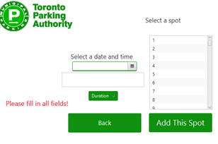

# ParkingLotBooking
Parking Lot Booking Application using IEEE specifications, built using JavaFX
<div align="center">

</div>

## To Run
Navigate to */ParkingApp/src/application* 
1. run ```javac Main.java```
2. run ```java Main```


## Documentation
UML diagram and IEEE specifications can be found in */Specifications*


